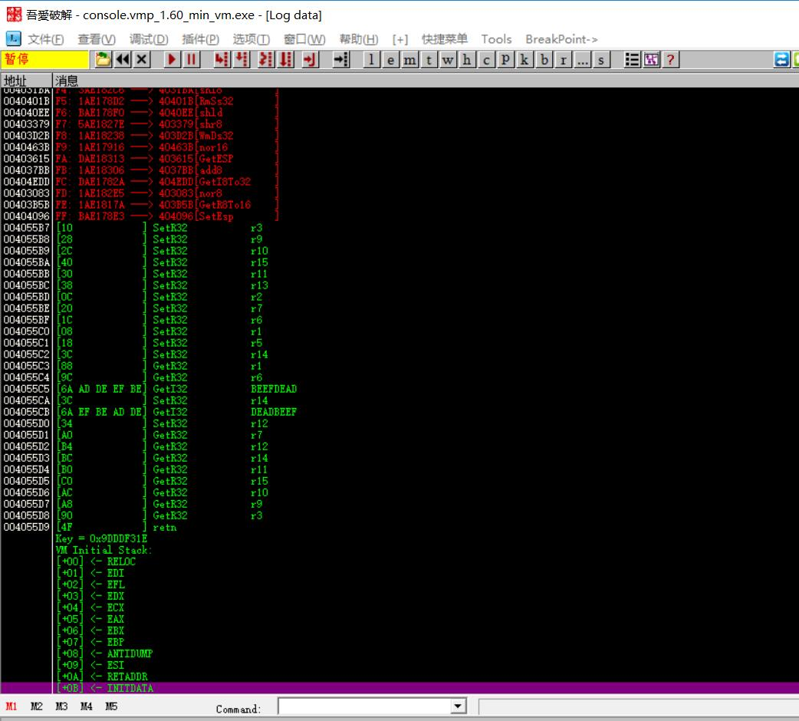
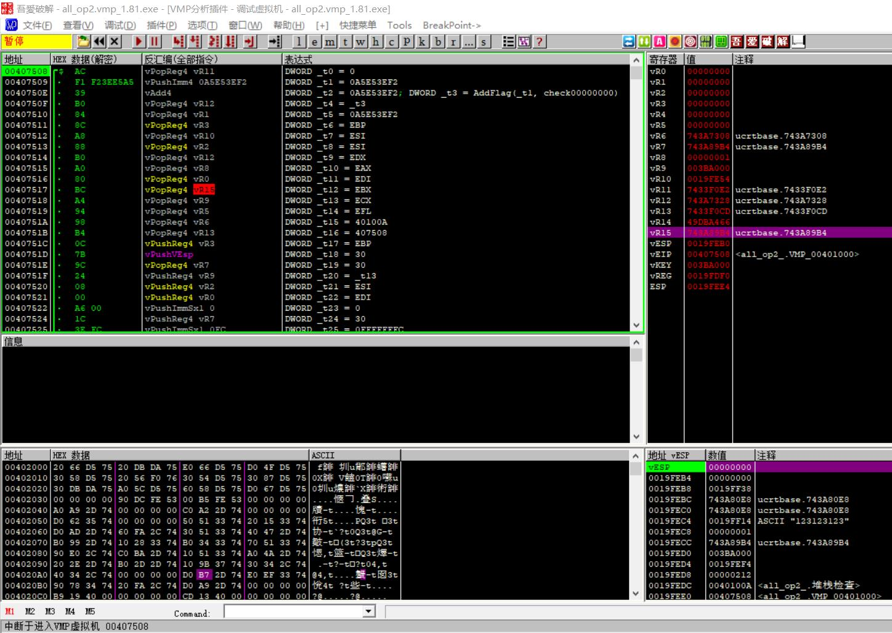

# awesome-vmp

关于软件虚拟化保护（如VMProtect）的资料。

工具篇介绍了VM保护的现有分析工具，并进行了简单的试用分析。

文章篇介绍了VM保护相关的分析文章，包括对虚拟机的分析，及一些反混淆方法。

# 工具篇

## FKVMP

- 针对目标：VMProtect 1.x 2.x （大概到 VMProtect 2.09）
- 类型：Ollydbg 插件
- 开发者：Nooby
- 功能：Handler 识别、还原 PCODE 等


FKVMP 是比较古老的一款 Ollydbg 插件，但在当时非常有名。

使用方法简单，在虚拟机入口处（push/call 或 jmp）右键 FKVMP -> start 即可。

下图是对如下代码
```
mov ebx, 0deadbeefh
mov eax, 0beefdeadh
```
使用 VMProtect 1.60 保护后， 使用 FKVMP 分析的结果（结果打印在 OD 的日志窗口中）。



可以所有Handler已经为指令都已经识别出来，初始化压栈的寄存器顺序也会打印出来。

本工具（可能是第1次完成）字节码的还原的实现（其实可以认为是虚拟机指令的反汇编）使对 VMProtect 的人工分析成为可能。

缺点是只支持单一的基本块，每次分析到 SetEIP 指令（实际就是跳转指令）就会停止，需要人工操作，去分析下一基本块。

## VMP分析插件

- 针对目标：VMProtect 1.x 2.x （大概到 VMProtect 2.09）
- 类型：Ollydbg / Immunity Debugger 插件
- 开发者：zdhysd 
- 功能：Handler 识别、虚拟字节码调试、表达式化简
- 链接：https://bbs.pediy.com/thread-154621.htm
- 最后更新时间：v1.4 2013/01/30

可以认为是 FKVMP 的超级加强版，在同类工具之中功能最为强度的工具。

首先该工具支持了跨基本块的分析，可以一次性将全部虚拟机字节码提取出来。除此外，还有许多亮点功能：
- **虚拟指令级别的调试**。可以像调试汇编一样调试虚拟机指令，可以单步运行一条虚拟指令，并查看虚拟寄存器、虚拟栈的信息。
- **表达式转化及化简**。本功能会在虚拟指令级别进行数据流和控制流的分析，进行字节码的收缩。 VMProtect 是栈机结构，同时有 NOR 逻辑的混淆膨胀，字节码的收缩还原一直是研究的重点，本工具可以完成字节码收缩过程，输出收缩后的表达式。唯一不同是没有转化成原始的 x86 代码。但在分析上，已经可以提供极为有力的参考。
- **支持字节码的 Patch**。由于加密的存在，字节码 Patch 一直是十分痛苦的过程，本工具可以像 Patch 普通指令一样 Patch 虚拟指令。
- **支持自定义模板**。模板包括 Handler 识别模板和表达式化简模板。该工具提供了模板文件及模板修改工具。理论上，可以通过对模板文件的修改使及兼容所有版本的 VMProtect 1.x 2.x。（ 3.x 因为虚拟机结构变化不能支持）。

下图是工具使用截图。该工具以插件的形式，实现了一个与原生OD非常相似的VMP调试界面，寄存器、栈的内容可以实时查看。



使用方法简单，在虚拟机入口处（push/call 或 jmp）右键 VMP分析插件 -> 分析虚拟程序 完成分析。然后可以打开插件的虚拟指令窗口、调试窗口查看字节码并进行调试分析。

## VMSweeper 

- 针对目标：VMProtect 2.x 、Code Virtualizer
- 类型：Ollydbg 插件
- 开发者：Vamit
- 功能：VMProtect 保护下的 x86 代码还原
- 最后更新时间：v1.5 2014

可以完成 VMP 保护代码还原的工具。 完全的代码还原是十分困难的，因此该工具稳定性不高，经常出现异常。但是某些简单样本的测试，确实有不错的还原效果。

使用方法：
1. 使用纯净版 OD 加载插件，避免插件间冲突。
2. Plugins -> VMPSweeper -> Analyze all VM reference
3. 弹出窗口选要分析的 VM， 右键 Decode VM。
4. 此时会自动在虚拟机入口点断下，F1 快捷键，VMSweeper会开始进行分析。
5. 分析完成后，会弹出提示框重新运行进程。重新运行后， Plugins -> VMPSweeper -> Continue decode VM。继续分析。
6. 如果分析没有产生任何异常，VMPSweeper 会把还原后的代码 Patch 到原本的虚拟机入口处。
7. 但上述过程经常出错，可以在 OD 根目录下查找 VMS_xxx 文件夹，查看日志文件，*.log 文件中保存着还原的过程输出。

如下是log文件截取。

```
...

++++++++++++++++++++++++++++++++++++
  Section a12 final
++++++++++++++++++++++++++++++++++++

004100BC: push ebp
004100C2: rvm_38 = esp
004100C9: push esi
004100D5: push edi
004100F6: [rvm_38 + 0xFFFFFFFC] = 0
00410111: eax = [rvm_38 + 0xFFFFFFFC]
00410131: rvm_34 = [rvm_38 + 8]
00410167: eax = [eax * 4 + rvm_34]
00410186: rvm_10 = [rvm_38 + 0xFFFFFFFC]
004101A6: edi = [rvm_38 + 8]
004101EC: rvm_08 = [rvm_10 * 4 + edi + 4 + eax]
0041021C: eax = [rvm_38 + 0xFFFFFFFC]
0041023C: rvm_10 = [rvm_38 + 0x0000000C]
00410278: [eax * 4 + rvm_10] = rvm_08
00410292: rvm_34 = [rvm_38 + 0xFFFFFFFC]
0041029C: eax = rvm_34 + 1
004102D4: [rvm_38 + 0xFFFFFFFC] = eax
004102EF: edx = [rvm_38 + 0xFFFFFFFC]
0041030F: eax = [rvm_38 + 8]
0041032F: rvm_18 = [rvm_38 + 0xFFFFFFFC]
0041034F: eax = [rvm_38 + 8]
00410385: rvm_3C = [edx * 4 + eax]
00410466: edi = and ~and ~rvm_3C, [rvm_18 * 4 + rvm_24 + ~4], ~and rvm_3C, [rvm_18 * 4 + rvm_24 + 4]

...
```

这是还原出来的 x86 代码。其中 rvm 是寄存器未推断出结果导致的。完美还原的代码会形成 完整的 x86 指令。

该工具是少见的可以将 VMProtect 保护代码进行完整还原的工具，缺点是稳定性太差，对于稍复杂的程序，还原过程很大可能会出现异常报错。

根据工具的说明，似乎是应该支持 Code Virtualizer的。测试成功还原 Code Virtualizer 1.3.8 版本未成功。

## Oreans UnVirtualizer 

- 针对目标：Oreans系列 Code Virtualizer / Themida / WinLicense
- 类型：Ollydbg 插件
- 开发者：Deathway
- 功能：Oreans 保护下的 x86 代码还原
- 最后更新时间：v1.8 2014/02/04

可以支持 Oreans 系列保护工具早期版本的 x86 还原。但对新版本的 FISH/TIGER 等系列虚拟机效果不佳。

使用：在虚拟机入口，右键分析，如果还原成功会弹出还原代码的文本文件。

如下是对 Code Virtualizer v1.3.8 代码还原的结果示意。 如果还原成功则与原代码基本一致（对CISC体系效果较好）。
```
...

@Label_00409223
	00409252	MOV DWORD PTR [EBP+0xfffffffc],0x0
	00409263	MOV EAX,DWORD PTR [EBP+0xfffffffc]
	00409281	MOV DWORD PTR [EBP+0xfffffff8],EAX
	00409291	JMP 0x4c


@Label_00409297
	00409297	MOV ECX,DWORD PTR [EBP+0xfffffff8]
	004092AC	ADD ECX,0x1
	004092C3	MOV DWORD PTR [EBP+0xfffffff8],ECX


@Label_004092E2
	004092E2	MOV EDX,DWORD PTR [EBP+0xfffffff8]
	004092F2	CMP EDX,DWORD PTR [EBP+0xc]
	0040930A	JNB 0x7b2
	0040930F	MOV EAX,DWORD PTR [EBP+0xfffffff8]

...
```

## VMAttack

- 针对目标：VMProtect
- 类型：IDA 插件
- 开发者：anatolikalysch
- 功能：VMProtect伪代码还原、动静态分析
- 链接：https://github.com/anatolikalysch/VMAttack
- 最后更新时间：2017

从官方 demo 上看，应该只支持去混淆的 VMProtect demo 版。

2016 IDA插件大赛第2名

相关论文：[Kalysch A, Götzfried J, Müller T. VMAttack: Deobfuscating Virtualization-Based Packed Binaries[C]// The, International Conference. 2017:1-10.](https://www1.cs.fau.de/filepool/publications/unpacking-dynamic-static.pdf)

## VirtualDeobfuscator

- 针对目标：通用类(?)
- 类型：Python脚本
- 开发者：jnraber
- 功能：Trace化简
- 链接：https://github.com/jnraber/VirtualDeobfuscator
- 最后更新时间：2013

2013 年 Blackhat视频：  https://www.youtube.com/watch?v=hoda99l5y_g  


## 其他
VMP 1.7 完整还原
http://bbs.pediy.com/thread-155215.htm

VMP Handler 分析插件 https://github.com/OoWoodOne/VMP_ODPlugin

Zeus--VMProtect分析及自动脱壳插件 by ximo http://www.52pojie.cn/thread-129047-1-1.html

VMP调试器
https://github.com/uvbs/VMPDBG2

CV 反编译
https://github.com/pakt/decv

Code Deobfuscator
https://forum.tuts4you.com/topic/37952-code-deobfuscator/
https://github.com/Pigrecos/CodeDeobfuscator

# 文章篇

## 会议PPT

- [KCon 2016 - VMProtect 的一次奇妙之旅 by 何潇潇](ppt/KCon2016_VMProtect_by_hxx.pdf)

- [SecurityDay 2015 - Inside VMProtect by Samuel Chevet](ppt/SecurityDay2015_Inside_VMProtect_by_Samuel_Chevet.pdf)

- [CSAW 2016 - How Triton can help to reverse virtual machine based
software protections by Jonathan Salwan](ppt/CSAW2016_How_Triton_can_help_to_reverse_virtual_machine_based_software_protections.pdf)

- [BlackHat 2013 - Removing virtualization obfuscations from malware – a DARPA Cyber Fast Track funded effort by Raber ](ppt/US-13-Raber-Virtual-Deobfuscator-A-DARPA-Cyber-Fast-Track-Funded-Effort-Slides.pdf)

- [中国软件安全峰会 2009 - VMProtect的逆向分析和静态还原 by Bughoho](ppt/VMProtect的逆向分析和静态还原.pdf)

- [CARO 2008 - Dealing with Virtualization packer by Boris Lau](ppt/CARO2008_Dealing_with_Virtualization_packer.pdf)


## 学术文章

- Xie, H., Zhang, Y., Li, J., & Gu, D. (2017). Nightingale: Translating Embedded VM Code in x86 Binary Executables. Information Security.
  - Video: https://www.youtube.com/watch?v=Owni02VD1JM&index=62&list=PLo8TkAG2ez595_Lie4rhjLL_oN5vLMWVa
- Yadegari, B. and S. Debray (2015). Symbolic Execution of Obfuscated Code. ACM Sigsac Conference on Computer and Communications Security: 732-744.
- Yadegari, B. and B. Johannesmeyer, et al. (2015). A Generic Approach to Automatic Deobfuscation of Executable Code. IEEE Symposium on Security and Privacy.
- Kinder, J. (2012). "Towards Static Analysis of Virtualization-Obfuscated Binaries." Proc.working Conf.reverse Engineering: 61-70.
- Coogan, K. and G. Lu, et al. (2011). Deobfuscation of virtualization-obfuscated software: a semantics-based approach. ACM Conference on Computer and Communications Security, CCS 2011, Chicago, Illinois, Usa, October.
- Rolles, R. (2009). Unpacking virtualization obfuscators.
- Sharif, M. and A. Lanzi, et al. (2009). Automatic Reverse Engineering of Malware Emulators. IEEE Symposium on Security and Privacy.


## 其他

- 2018年 FinSpy VM 分析及代码还原系列 by Rolf Rolles（该作者有十年以上的VM保护的研究经验，非常值得一读） 
  - [A WALK-THROUGH TUTORIAL, WITH CODE, ON STATICALLY UNPACKING THE FINSPY VM: PART ONE, X86 DEOBFUSCATION](http://www.msreverseengineering.com/blog/2018/1/23/a-walk-through-tutorial-with-code-on-statically-unpacking-the-finspy-vm-part-one-x86-deobfuscation)

  - [FINSPY VM PART 2: VM ANALYSIS AND BYTECODE DISASSEMBLY](http://www.msreverseengineering.com/blog/2018/1/31/finspy-vm-part-2-vm-analysis-and-bytecode-disassembly)

  - [FINSPY VM UNPACKING TUTORIAL PART 3: DEVIRTUALIZATION](http://www.msreverseengineering.com/blog/2018/2/21/finspy-vm-unpacking-tutorial-part-3-devirtualization)

- [FinFisher VM分析 白皮书](https://www.welivesecurity.com/wp-content/uploads/2018/01/WP-FinFisher.pdf)

- [ZeusVM analysis - Miasm's blog](http://www.miasm.re/blog/2016/09/03/zeusvm_analysis.html)


- [汇集所有能帮助你对抗强壳的知识（VMP、SE、THEMIDA、Enigma）](https://bbs.pediy.com/thread-224537.htm)

- [VMProtect 2.06全过程分析 by hkfans](https://bbs.pediy.com/thread-147164.htm)

- [Themida 1.2.0.1 全过程分析	by hkfans](https://bbs.pediy.com/thread-132522.htm)

- [Themida 1.9.1.x CICS Processor VM 简单分析 by softworm](note/softworm_Themida_1.9.1.x_CISC.pdf)

- [人肉某CM-VMP2.13.8 Vmcode (可视化) by Sound](http://www.52pojie.cn/thread-454649-1-1.html)

- [VMProtect 逆向分析 by aalss2](note/aalss2_Vmprotect.pdf)

- [VMSweeper 分析 by aalss2](note/aalss2_VMSweeper.pdf)

- [VMProtect 学习 by OoWoodOne](note/OoWoodOne_VMProtect.pdf)

- [Inside Code Virtualizer by scherzo  February 16  2007](note/2007_scherzo_Inside_Code_Virtualizer.pdf)

